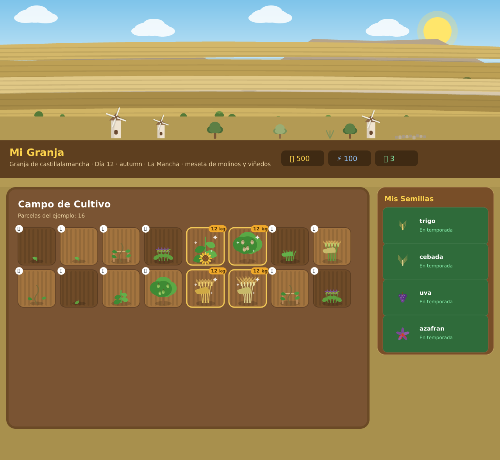
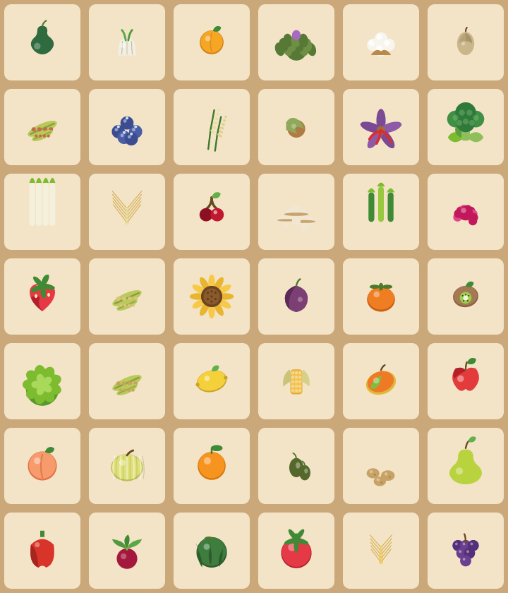

# 🌾 ElectroCultivo

Juego de agricultura ambientado en las **15 regiones agrícolas de España**. Cultiva productos
reales (trigo, azafrán, uva, naranjas, aguacate...), mejora tus parcelas con **electrocultura** y
viaja por el país desbloqueando granjas nuevas.



## ✨ Novedades de esta versión (v2.1 · "granjas vivas")

### Arte vectorial de los cultivos
- **42 cultivos** dibujados como SVG en línea (`js/sprites.js`), sin imágenes externas ni canvas.
- **4 fases de crecimiento** por cultivo, con la forma real del fruto:
  brote → plántula → fruto cuajado (verde) → **listo para cosechar** (color real).
- Cogollos de lechuga, pellas de brócoli, panojas de maíz, racimos de uva, aceitunas, azafrán con
  sus estigmas rojos, fresas, higos, kiwis, aguacates... cada uno reconocible de un vistazo.
- Los frutos de raíz (patata, remolacha, ajo) asoman del caballón; las vides crecen en espaldera;
  los melones y sandías se tumban sobre el suelo.
- Icono de producto independiente para tienda, inventario, calendario y cosecha.

### Entornos adaptados a cada lugar real
Cada región tiene su paisaje propio (`js/environment.js`), compuesto por capas con paralaje suave:

| Región | Paisaje |
| --- | --- |
| Castilla-La Mancha | meseta, molinos de viento, viñedos y olivar |
| Aragón | Pirineo nevado, cipreses y almendros en flor |
| Extremadura | dehesa de encinas con ganado |
| La Rioja | sierra, hileras de viñedo y bodega |
| Murcia | secano, palmeras, invernaderos y mar |
| Valencia | arrozales de la Albufera, naranjos y barracas |
| Cataluña | Montseny, masía, cipreses y avellanos |
| Castilla y León | campos de cereal, castillo y silos |
| Navarra | huerta, río, Pirineo verde y espárragos |
| País Vasco | caserío, prados, manzanos y vacas |
| Cantabria | Picos de Europa, ganado y emparrado de kiwi |
| Asturias | hórreo, manzanos y montaña |
| Galicia | rías, bancales, hórreo y niebla |
| Madrid | Sierra de Guadarrama y fresales |
| Andalucía | mar de olivos, cortijo y Sierra Nevada |

Además:
- **Ciclo día/noche** conmutable (día, atardecer, noche, amanecer) desde el botón 🌅.
- **Ambiente por estación**: hojas de otoño, pétalos de primavera, calor del verano, nieve/lluvia del
  invierno, mariposas y luciérnagas; niebla en el norte y calima en el sureste.
- Todos los gráficos son vectoriales y se generan en el navegador: **la web sigue siendo estática y
  ligera** (sin dependencias nuevas ni descargas de imágenes).

### Jugabilidad
- Parcelas con aspecto de tierra arada (surcos, caballones, brillo al estar regadas).
- Estados legibles: brote/plántula/fruto con chapa de progreso y destello cuando está listo.
- **Cosecha táctil** con los frutos reales del cultivo (y no saturada cuando el rendimiento es alto).
- **Avisos breves (toasts)** en lugar de ventanas bloqueantes, y celebración al subir de nivel.
- Guardado automático también al arar, regar y cosechar.
- Ficha de región en el mapa con sus cultivos, temporada y viaje directo a la granja.

## 🎮 Cómo jugar

1. Abre `index.html` (o sirve la carpeta con `npm run serve`) y pulsa **JUGAR → Jugar en Local**.
2. Elige una parcela: **mantén pulsado** para ararla y toca para plantar.
3. **Mantén pulsado** sobre una planta para regarla (crece un 50% más rápido).
4. Cuando brille, tócala y recoge la cosecha a mano.
5. Vende en la tienda, compra semillas y equipos de **electrocultura**, y sube de nivel para
   desbloquear las siguientes regiones.

## 🧩 Estructura

```
index.html            Interfaz del juego (Tailwind por CDN + estilos propios)
css/styles.css        Estilos, cielo/capas del paisaje, partículas y parcelas
js/data.js            Datos de juego: regiones, cultivos, herramientas, electrocultura
js/sprites.js         Arte vectorial de los cultivos (fases de crecimiento y productos)
js/environment.js     Escenarios regionales (cielo, sierra, campos, aperos y ambiente)
js/map.js             Mapa de España interactivo y ficha de cada región
js/game.js            Lógica del juego, render de la granja, UI y persistencia
auth-server.js        Servidor opcional de autenticación con Google/Supabase
tests/smoke.js        Pruebas de humo del front-end (jsdom)
tools/                Utilidades de desarrollo para previsualizar el arte
```

## 🚀 Puesta en marcha

```bash
npm install          # solo para las pruebas (jsdom)
npm test             # pruebas de humo del juego
npm run serve        # sirve el juego en http://localhost:8080
```

Autenticación con Google (opcional):

```bash
cp .env.example .env   # SUPABASE_URL, SUPABASE_KEY, FRONTEND_URL, PORT
npm start              # servidor de autenticación
```

## 🎨 Utilidades de arte

Generan hojas de contactos y vistas previas para revisar el arte sin abrir el navegador
(requieren `npm i -D @resvg/resvg-js`):

```bash
node tools/sprite-sheet.js stages   /tmp/fases.png        # las 4 fases de cada cultivo
node tools/sprite-sheet.js products /tmp/productos.png    # iconos de producto
node tools/farm-preview.js valencia summer 0 /tmp/granja.png
```

## 📷 Galería

|cultivos|
|---|
||
